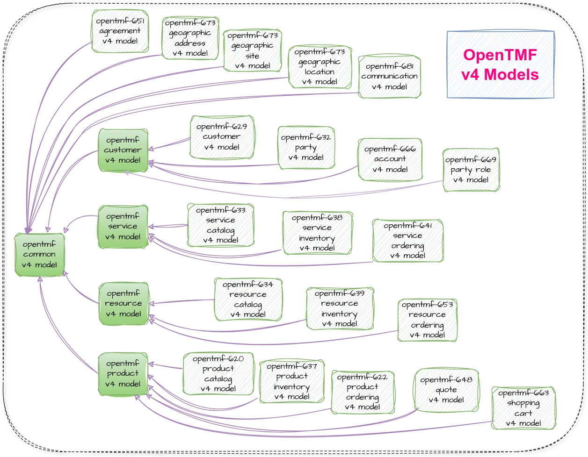

# opentmf-v4-models

Contains the model classes directly generated from the official vanilla swagger specifications
of the related TMF modules, with minimal manual adaptations for class inheritance and reuse.

The project is a multi-module project, that packages the commonly used classes in the
common group modules and the single module referenced classes in their corresponding tmf modules.

Currently, it holds the original model classes for the following TMF APIs:

- [TMF-620](tmf-620-model/README.md) (4.1.0.5) Product Catalog Management API
- [TMF-622](tmf-622-model/README.md) (4.0.0.5) Product Ordering Management API
- [TMF-629](tmf-629-model/README.md) (4.0.0.5) Customer Management API
- [TMF-632](tmf-632-model/README.md) (4.0.0.5) Party Management API
- [TMF-633](tmf-633-model/README.md) (4.0.0.5) Service Catalog Management API
- [TMF-634](tmf-634-model/README.md) (4.1.0.5) Resource Catalog Management API
- [TMF-637](tmf-637-model/README.md) (4.0.0.5) Product Inventory Management API
- [TMF-638](tmf-638-model/README.md) (4.0.0.5) Service Inventory Management API
- [TMF-639](tmf-639-model/README.md) (4.0.0.5) Resource Inventory Management API
- [TMF-641](tmf-641-model/README.md) (4.1.0.5) Service Ordering Management API
- [TMF-648](tmf-648-model/README.md) (4.0.0.5) Quote Management API
- [TMF-651](tmf-651-model/README.md) (4.0.0.5) Agreement
- [TMF-652](tmf-652-model/README.md) (4.0.0.5) Resource Order Management API
- [TMF-663](tmf-663-model/README.md) (4.0.0.5) Shopping Cart Management API
- [TMF-666](tmf-666-model/README.md) (4.0.0.5) Account Management API
- [TMF-669](tmf-669-model/README.md) (4.0.0.5) Party Role Management API
- [TMF-673](tmf-673-model/README.md) (4.0.1.5) Geographic Address Management API
- [TMF-674](tmf-674-model/README.md) (4.0.0.5) Geographic Site Management API
- [TMF-675](tmf-675-model/README.md) (4.0.0.5) Geographic Location API
- [TMF-681](tmf-681-model/README.md) (4.0.0.5) Communication Management API

## Dependencies

The opentmf-v4-models libraries depend on the [opentmf-commons](https://github.com/opentmf/opentmf-commons)
library that provides the following:

- `JacksonUtil` Class:
  - Provides a singleton ObjectMapper and utility methods.
- `ValidationUtil` Class:
  - Provides utility methods for on-demand bean validation.
- Validation Annotations:
  - `@SafeText`: Allows only a set of safe characters for strings.
  - `@SafeId`: Allows only alphanumeric characters, underscore and minus.
  - `@SafeQuery`: Allows only a set of safe characters for URL queries.
  - `@SafeJsonPath`: Allows only certain special characters necessary to build a json path string, in addition to the English alphanumeric characters.
  - `@Required`: A class level annotation to act as  `@NotNull` for inherited properties. Validates only and only if, at the time of the validation, the initialized `@Required` belongs to the actual declaring class itself, not to a parent class.
- Other useful utility methods like `ListUtil`, `PropertyUtil` and `UrlUtil`, that do not depend on Spring framework.

## Layered Approach

The opentmf-v4-models library has been designed to be extendable with layers.
This layer is the original TMF v4 models.
There can be additional layers to incorporate extensions by other projects.

The following image shows the released artifacts and their dependencies
within tmf-v4-models:



## Usage Example
We might want to use some extended attributes of a particular TMF backend, by extending the above
vanilla TMF model classes. For example, the product ordering management microservice of DNext.
In such a case, we can extend the ProductOrder class and place additional attributes that will be
used by the DNext microservice. The below example assumes we have such a model artifact.

Let's suppose, we have a microservice that depends on opentmf-641-v4-model and
the assumed dnext-opentmf-622-v4-model classes. In order to use them, we can expose the
ObjectMapper bean as follows:

```java
@Component
public class JacksonConfig {

  @Primary
  @Bean
  public ObjectMapper objectMapper() {

    // start with the default initialized ObjectMapper instance by the util class
    var objectMapper = JacksonUtil.getDefaultObjectMapper();

    // extension initializations for the desired modules
    DnextTmf622JacksonConfig.registerExtensions(objectMapper);
    Tmf641JacksonConfig.registerExtensions(objectMapper);

    // if necessary, other objectMapper initialization that are specific to that microservice
    // ...
    // ...

    // finally, return this initialized ObjectMapper.
    // This will be used by Spring Boot for all APIs.
    // You will be able to use JacksonUtil methods too.
    return objectMapper;
  }
}
```

Since the `JacksonUtil` library uses the single `ObjectMapper` it instantiates in its utility methods,
the above method is very convenient for using the library's utility methods.

## Requirements

- Java 17 or newer.

## Version History
### 1.0.0
- Initial version.
### 1.0.1
- Adds TMF-648 Quote models.
### 1.0.2
- Moves projects to -v4 folders.
### 1.0.3
- Adds TMF-681 Communications Management model.
### 1.0.4
- The first open-source release.
### 1.0.5
- Updates opentmf-commons dependency to 1.0.5
